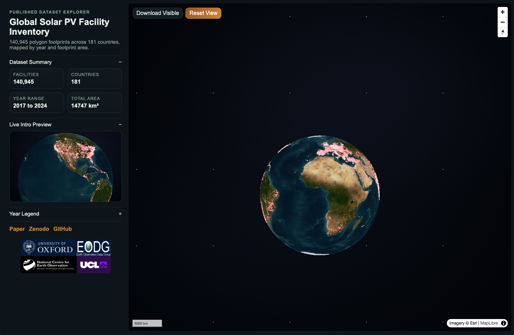

# Coal plants persist as a large barrier to the global solar energy transition - Dataset

[](https://pvfacilitymap.uk/)
[](https://zenodo.org/records/18794231)
[](LICENSE)

## Interactive Dashboard
Explore the facility-level PV generation and aerosol-loss dataset interactively at **[pvfacilitymap.uk](https://pvfacilitymap.uk/)**.

<a href="https://pvfacilitymap.uk/">
  
</a>

> Click the preview to open the live dashboard in a new tab. The dashboard complements this repository: this repo provides the raw data and reproducible scripts, while the dashboard offers a visual, exploratory entry point.

## Overview
This repository provides example code and reproducible plotting workflows for the global facility-level solar PV dataset associated with the manuscript:

**Coal plants persist as a large barrier to the global solar energy transition**.

The dataset used here includes:
- a global PV facility inventory (`PV_ID`, latitude, longitude, country, year, area)
- yearly facility-level PV generation and aerosol-related loss files (`PV_facility_generation_year_YYYY.csv`)

The goal of this repo is practical reproducibility:
- understand dataset structure quickly
- reproduce selected manuscript-style aggregate figures
- provide a clean codebase that can be extended in future

## Data Source and Citation
This repository contains convenient working copies of selected files for examples.
For scientific use and citation, the authoritative dataset source is Zenodo:

- Zenodo record: https://zenodo.org/records/18794231
- Zenodo DOI: `10.5281/zenodo.18794231`

Please cite:
1. The Zenodo dataset DOI (`10.5281/zenodo.18794231`).
2. The manuscript.
3. This repository version/commit (if using scripts from this repo).

Code license: `MIT` (see `LICENSE`).
Dataset license and usage terms: follow the Zenodo record.

Citation metadata is also provided in `CITATION.cff`.

## Repository Layout
- `data/`: dataset files used by example scripts
- `scripts/examples/`: runnable analysis and figure-replication scripts
- `outputs/tables/`: generated summary tables
- `outputs/figures/`: generated figures
- `docs/`: data dictionary and release notes
- `metadata/`: metadata and checksum files
- `src/`: reusable modules (for future expansion)
- `tests/`: tests

## Quick Start
```bash
python -m venv .venv
source .venv/bin/activate
pip install -r requirements.txt
```

Run core scripts:
```bash
python scripts/examples/interpret_global_pv_parquet.py --save-output
python scripts/examples/plot_aerosol_loss_vs_new_generation.py
python scripts/examples/plot_country_aerosol_loss_2023.py
```

## Figure Replication
- Global aerosol-loss vs new PV generation:
```bash
python scripts/examples/plot_aerosol_loss_vs_new_generation.py --year-start 2017 --year-end 2023
```

- Manuscript Fig.2f style (2023 country comparison):
```bash
python scripts/examples/plot_country_aerosol_loss_2023.py
```

## Expected Sanity Checks
If the input files are unchanged, key outputs should be close to:

- `plot_country_aerosol_loss_2023.py`
  - China aerosol-loss share: ~`54.91%`
  - India aerosol-loss share: ~`12.99%`
  - USA aerosol-loss share: ~`9.63%`

## Output File Policy
- Figure files in `outputs/figures` (`.png`, `.pdf`) are versioned for reference.
- Table outputs in `outputs/tables` remain ignored by Git (except `.gitkeep`).
- Regenerate outputs by rerunning scripts locally.

## Included Data Files
- `data/global_pv_facility_inventory.csv`
- `data/pv_generation_losses/PV_facility_generation_year_2017.csv`
- `data/pv_generation_losses/PV_facility_generation_year_2018.csv`
- `data/pv_generation_losses/PV_facility_generation_year_2019.csv`
- `data/pv_generation_losses/PV_facility_generation_year_2020.csv`
- `data/pv_generation_losses/PV_facility_generation_year_2021.csv`
- `data/pv_generation_losses/PV_facility_generation_year_2022.csv`
- `data/pv_generation_losses/PV_facility_generation_year_2023.csv`

## Release Notes
See `CHANGELOG.md`.
